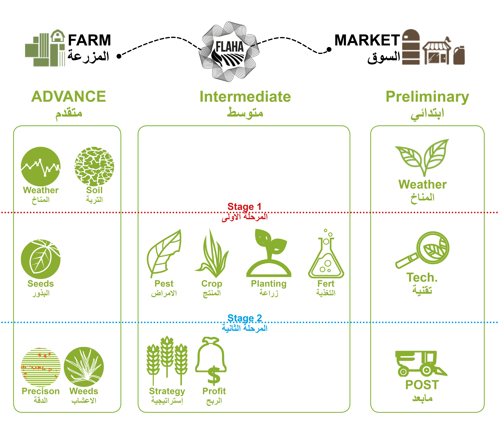

 

language : markdown

This is a documentation for Flaha Ag Platform - We will Explain the Agriculture Precision from A-Z and provide the most Advanced Topics up to date.

!!! note
    {==Our Platform under construction and we are working continuasly on weekly base, so every Saturday we will have new update.==}

 

### Collaboration

This document  can be edited on [GitHub](https://github.com/FlahaAG/Flaha_Wiki) in markdown. If you find any mistakes, typos or  pieces that are not documented well enough simply open an issue or contribute by sending a pull request.

~~Paragraph was deleted and replaced with some spaces.~~

CH~3~CH~2~OH

Here is some {--*incorrect*--} Markdown.  I am adding this{++ here++}.  
Here is some more {--text that I am removing--}text.  
And here is even more {++text that I am ++}adding.

And here is a comment on ==some text== This works quite well. I just wanted to comment on it. Substitutions is{++are++} great!

!!! attention
    we are looking forward to translate this Platform to multilanguage when its come to the optimum level as we will descrip it on the Annually plan. and we will provide you will the Plan Soooooon. Thanks in Advance.

### Discussion

We are happy to answer any questions at [FLAHA Forum](http://discourse.flaha.org/)

!!! important
    Your Contribution will help us improve this platform to cover the most sensetive Section of the Our Life, which will reflect on our enviroment, Health & future generation. and keep up on Open and social Knowldge base.
	
	??? note "Open styled details"

		??? danger "Nested details!"
			And more content again. And more content again.And more content again.And more content again.And more content again.And more content again.And more content again.And more content again.And more content again.
		??? warning classes
			Content.

!!! abstract "dont do that"
    Lorem ipsum dolor sit amet, consectetur adipiscing elit. Nulla et euismod
    nulla. Curabitur feugiat, tortor non consequat finibus, justo purus auctor
    massa, nec semper lorem quam in massa.
!!! info
    Lorem ipsum dolor sit amet, consectetur adipiscing elit. Nulla et euismod
    nulla. Curabitur feugiat, tortor non consequat finibus, justo purus auctor
    massa, nec semper lorem quam in massa.	
!!! tip
    Lorem ipsum dolor sit amet, consectetur adipiscing elit. Nulla et euismod
    nulla. Curabitur feugiat, tortor non consequat finibus, justo purus auctor
    massa, nec semper lorem quam in massa.
!!! failure
    Lorem ipsum dolor sit amet, consectetur adipiscing elit. Nulla et euismod
    nulla. Curabitur feugiat, tortor non consequat finibus, justo purus auctor
    massa, nec semper lorem quam in massa. 
!!! example
    Lorem ipsum dolor sit amet, consectetur adipiscing elit. Nulla et euismod
    nulla. Curabitur feugiat, tortor non consequat finibus, justo purus auctor
    massa, nec semper lorem quam in massa.
!!! question
    Lorem ipsum dolor sit amet, consectetur adipiscing elit. Nulla et euismod
    nulla. Curabitur feugiat, tortor non consequat finibus, justo purus auctor
    massa, nec semper lorem quam in massa.
!!! danger
    Lorem ipsum dolor sit amet, consectetur adipiscing elit. Nulla et euismod
    nulla. Curabitur feugiat, tortor non consequat finibus, justo purus auctor
    massa, nec semper lorem quam in massa.
!!! success
    Lorem ipsum dolor sit amet, consectetur adipiscing elit. Nulla et euismod
    nulla. Curabitur feugiat, tortor non consequat finibus, justo purus auctor
    massa, nec semper lorem quam in massa.
	
!!! warning
    Lorem ipsum dolor sit amet, consectetur adipiscing elit. Nulla et euismod
    nulla. Curabitur feugiat, tortor non consequat finibus, justo purus auctor
    massa, nec semper lorem quam in massa.	
	
	

!!! bug
    Lorem ipsum dolor sit amet, consectetur adipiscing elit. Nulla et euismod
    nulla. Curabitur feugiat, tortor non consequat finibus, justo purus auctor
    massa, nec semper lorem quam in massa.
	
## Tentative roadmap
* [x] Lorem ipsum dolor sit amet, consectetur adipiscing elit
* [x] Nulla lobortis egestas semper
* [x] Curabitur elit nibh, euismod et ullamcorper at, iaculis feugiat est
* [ ] Vestibulum convallis sit amet nisi a tincidunt
    * [x] In hac habitasse platea dictumst
    * [x] In scelerisque nibh non dolor mollis congue sed et metus
    * [x] Sed egestas felis quis elit dapibus, ac aliquet turpis mattis
    * [ ] Praesent sed risus massa
* [ ] Aenean pretium efficitur erat, donec pharetra, ligula non scelerisque
* [ ] Nulla vel eros ve

:thumbsup: ipsum dolor sit amet: $p(x|y) = \frac{p(y|x)p(x)}{p(y)}$

$$
\frac{n!}{k!(n-k)!} = \binom{n}{k}
$$

## Dependencies
- [ladybug](https://github.com/ladybug-tools/ladybug)
- [ladybug-grasshopper](https://github.com/ladybug-tools/ladybug-grasshopper)
